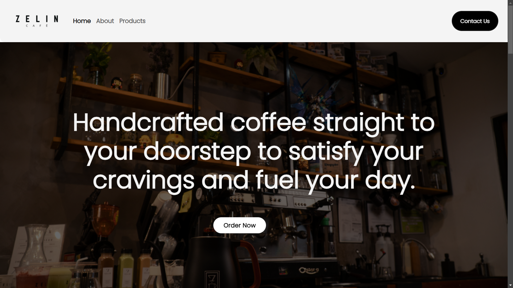

# Zelin Café - Website

Welcome to **Zelin Café's** official website repository! This is a modern, responsive, and user-friendly static website designed to showcase the café's menu, ambiance, and services.

## 🌟 Features
- **Responsive Design** – Optimized for mobile and desktop viewing
- **Elegant UI** – Aesthetic and easy-to-navigate layout
- **Menu Page** – Displays food and drinks with images and descriptions
- **Contact Section** – Includes location, social media links, and contact form
- **Smooth Animations** – Enhances user experience with subtle transitions

## 🛠️ Technologies Used
- **HTML** – Structure of the website
- **CSS (Bootstrap)** – Styling and responsiveness
- **JavaScript** – Interactive elements (e.g., navbar, animations)

## 📷 Screenshots


## 🚀 Live Demo
Check out the live version here: [Zelin Café Website](https://your-live-demo-link.com)

## 📌 Installation
To run the website locally:
1. Clone the repository:
   ```bash
   git clone https://github.com/yourusername/zelin-cafe.git
   ```
2. Open `index.html` in a browser.

## 📞 Contact
For any inquiries or suggestions, feel free to reach out:
📧 **Email:** johnhyneslongares@gmail.com  
🌍 **Website:** [Your Portfolio](https://your-portfolio-link.com)

---
© 2024 John Hynes Longares. All rights reserved.
